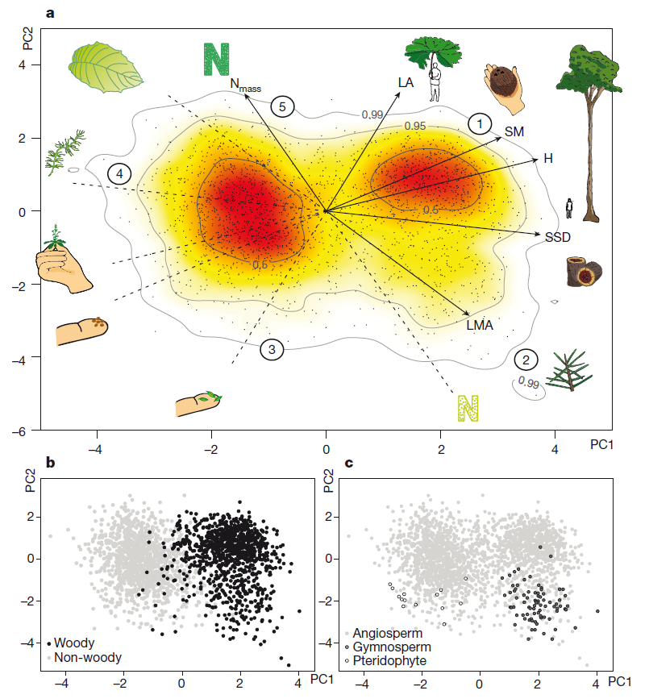
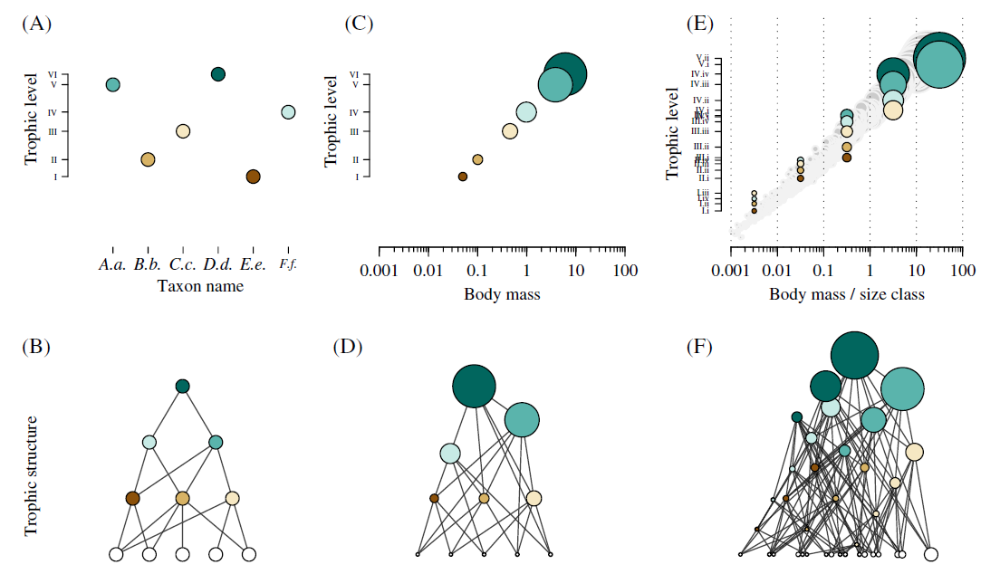
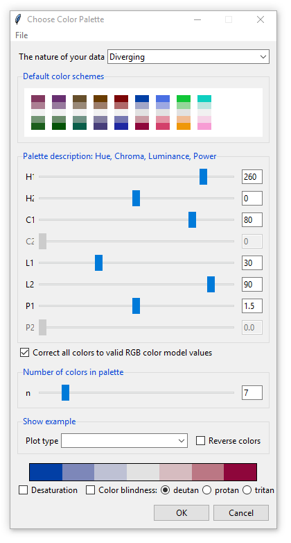
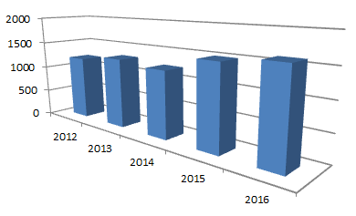
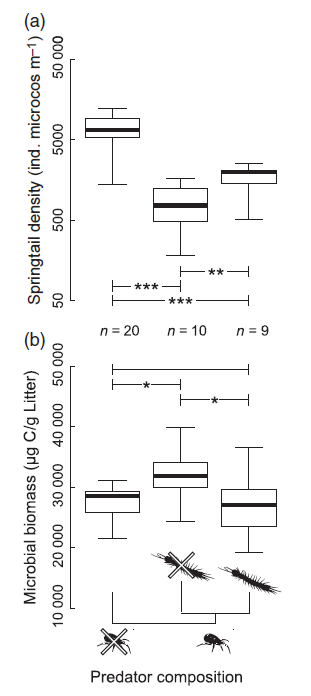
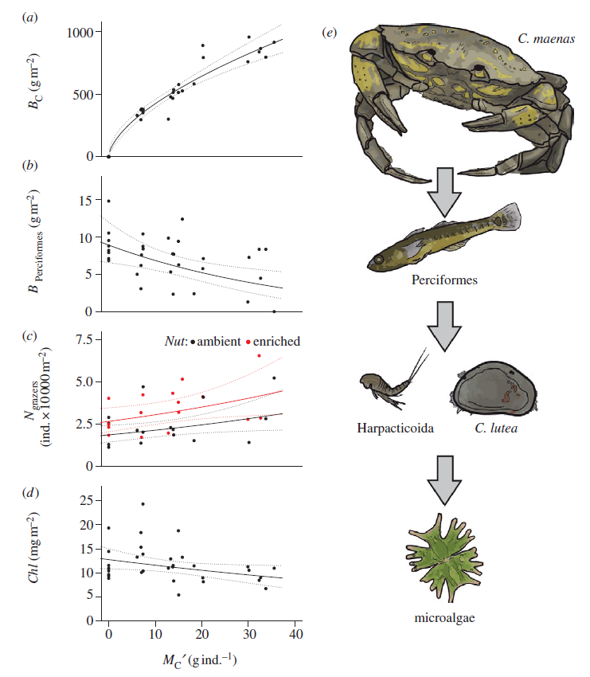
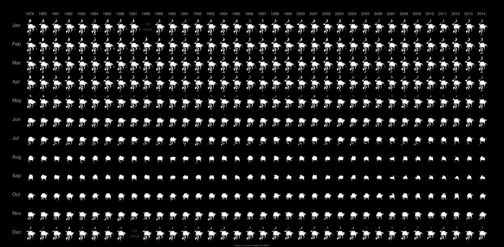
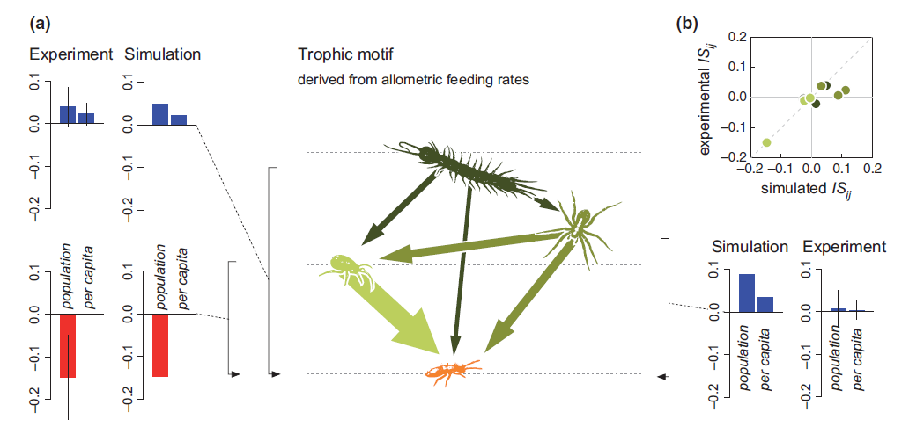
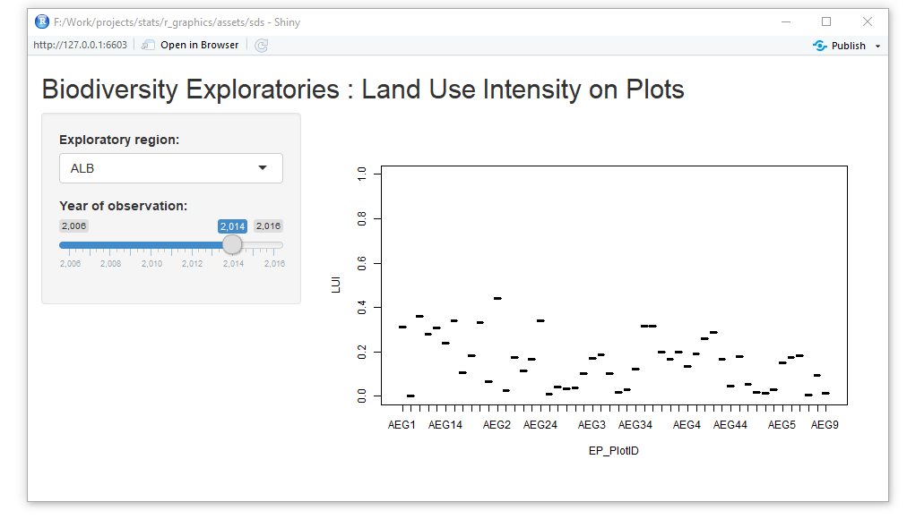

# Preface

This Workshop covers basic plotting in R and essential visual communication principles.

We will talk about: 

- Basic R plotting: low-level vs. high-level plotting commands, graphical parameters
- Plot elements: axes, points, lines, plotting region, labels, etc.
- Color in R plots: color handling in R, color ramps, color-blindness 
- Multi-panel plotting: mfrow, layout, etc.
- Advanced tools for plotting: 3D plotting functions, ggplot2, shiny
- Production output: saving output to a file, vector and raster plotting devices, post processing


## Preparations

The workshop is part of a three day workshop in R including sessions on data handling and basic and advanced statistical modelling and assumes knowledge of these sections.

If you work through this on your own, you may want to start with this [intro on the basics in R](http://fdschneider.de/r_basics/), and this [workshop on data handling(http://fdschneider.de/r_datahandling/).

The examples and code snippets require that you install the following packages:

```{r, eval = FALSE}
install.packages("ggplot2", "readxl", "data.table", "RColorBrewer", "colorspace", "Shiny")
```


For the following examples, I will use the datasets from wednesday: `LUI_factors`, `voeller` and `flowerdata`. 

```{r}
voeller <- read.csv("data/voeller.csv", encoding = "UTF-8")
flowerdata <- read.csv("data/flowerdata.csv", encoding = "UTF-8")
LUI_factors <- read.csv("data/LUI_factors.csv", encoding = "UTF-8")

```

We will refer to this dataset in the exercises: 

> Data from: Resource-mediated indirect effects of grassland management on arthropod diversity (2014) Simons NK, Gossner MM, Lewinsohn TM, Boch S, Lange M, Müller J, Pašalić E, Socher SA, Türke M, Fischer M, Weisser WW; DOI: https://doi.org/10.5061/dryad.f3b77

```{r}
library(readxl)
arthropods08 <- read_xlsx("data/Plant_herb_carn/01_Arthropods_2008.xlsx")
arthropods09 <- read_xlsx("data/Plant_herb_carn/01_Arthropods_2009.xlsx")
plantcover08 <- read_xlsx("data/Plant_herb_carn/02_Plant_cover_2008.xlsx")
plantcover09 <- read_xlsx("data/Plant_herb_carn/02_Plant_cover_2009.xlsx")

landuse <- read_xlsx("data/Plant_herb_carn/03_Landuse_2007to2009.xlsx")
semdata08 <- read_xlsx("data/Plant_herb_carn/04_SEMData_2008.xlsx")
semdata09 <- read_xlsx("data/Plant_herb_carn/04_SEMData_2009.xlsx")

library(data.table)
dd_full <- rbindlist(list(semdata08, semdata09), fill = TRUE)

dd_full <- transform(dd_full,
                  PlotID = as.factor(PlotID),
                  Region = as.factor(Region),
                  Lifestock = as.factor(Lifestock)
                  )

```


## Online Reference


**The presentation slides can be found [here](http://fdschneider.de/r_graphics/)!**

<a rel="license" href="http://creativecommons.org/licenses/by/4.0/"></a><br /><span xmlns:dct="http://purl.org/dc/terms/" href="http://purl.org/dc/dcmitype/Text" property="dct:title" rel="dct:type">R graphics</span> by <span xmlns:cc="http://creativecommons.org/ns#" property="cc:attributionName">Florian Schneider</span> is licensed under a <a rel="license" href="http://creativecommons.org/licenses/by/4.0/">Creative Commons Attribution 4.0 International License</a>.

```{r, echo = FALSE}

 f <- as.factor(c("A", "A", "B", "C", "A", "B", "B", "C", "C"))
 m <- matrix(sample(1:25,25), nrow = 5)
 d <- data.frame(x = f, y = c(1,1,1.4,1.2,1.3,1.2,1.4,1.2,1.1))
 l <- list(sample = f, covars = d, mat = m)
 model <- lm(d$y ~ d$x)
 b <- TRUE


```

---

# 1. About visual communication

*Visual*: 

- input interface is the eye of the recipient
- medium is print or screen

*Communication*: 

- sender side intentions: deliver data content; illustrate idea, complex concept; educate
- recipient side condition: context of current knowledge & conditions on exposure; conventions and expectations

Graphics often not standalone, but accompanying text. 

## Properties of scientific visualisations

In the first place, we show data. Visuals are adding high-resolution and detail, were text can only transport summary and statistics. 

Advantages of graphics: 

- high data density

**Example:** This two-dimensional mapping of multi-dimensional trait-space illustrates the global spectrum of plant form and function (Diaz et al. 2016). The lower panels illustrate subsets of the same data (b: woody plants, c: plant classes) . 



- put data in context (e.g. spatial maps!)

**Example:** besides the spatial context, maps contain information about area, shape, and neighborhood of a data point. It is easy to read where values are high or low because of spatial context and where and at which level to look for explanatory variables. 


*(Source: E.R. Tufte "The Visual Display of Quantitative Information")*

- increasing objectivity

**Example:**  Anscombes famous quartet of x-y datasets. Each dataset has exactly the same stats regarding means, coefficient of correlation, model fit etc., but visually, they tell a totally different story. 

```{r, echo = FALSE, height = 8, width = 8}

par(mfrow = c(2,2), mar = c(4,4,1,1), las = 1, bty = "n")
for(i in 1:4) {
  model <- lm(anscombe[,c(4)+i] ~ anscombe[,c(0)+i])
  
  plot(anscombe[,c(0,4)+i], xlim = c(0,20), ylim = c(0,20), pch = 20)
  abline(model)
  
  mtext(paste("R²=", round(summary(model)[]$r.squared, 2)), 3, -1, at = 0, adj = 0, cex = 0.7)
  mtext(paste("res. sum of squares =", round( sum(summary(model)[]$residuals^2), 1)), 3, -2, at = 0, adj = 0, cex = 0.7)
  mtext(paste("coeff.cor. =", round( cor(anscombe[,c(0)+i], anscombe[,c(4)+i]), 2)), 3, -3, at = 0, adj = 0, cex = 0.7)
}
```


## Graphical integrity

Good data analyses are one thing. But the complex results in science can not be transported by statistics alone. In research papers, figures should do a good part of the job. But very often, they do a bad job.

As a fundamental critique to the practice of graphical communication Edward Tufte published this series of books, where he elaborated on why graphics fail at being informative and – more importantly – fail at being truthful about the underlying pattern in the data.

In this workshop, in addition to the technical aspects, I want to discuss three big challenges of visual communication in Data Science:

1. Reduce noise
2. Be truthful
3. Build a narrative

Note that we are not talking about plots for reviewing your data (like Q-plot or analysis of residuals)! those have been covered in the statistics lecture by Caterina.

## A word on packages 

Many available R packages  facilitate plotting into publishable output. Particularly, **ggplot2** is a great tool to design graphics since it is build around the logic of plot design, separating content (i.e. the data) from aesthetics (i.e. the design and choice of elements). 

However here is a word of caution: Just like other software, like Excel or SASS, plotting packages come with the risk of ridding oneself of the responsability of thinking about plot elements. Indeed, one intention of those software packages is creating an own style that readers would recognise and make them use their software. 

I am using base R for my examples because I believe, first comes understanding at the low level of plotting grammar, before we can start using powerful tools. 

**Learn design principles! Not usage of tools.** 

After learning about the basics, we'll talk about ggplot2 as well. 

--- 

# 2. Basic grammar

In base R, plotting commands are either **high-level**, which means they create a new plot, or **low-level**, which means they add something to an existing plot. Additionally, on the highest level, there are the **graphical parameters** which define the plotting canvas, like margins and multi-panel arrangements. Finally, there are multiple **graphics devices**, virtual devices in which the plot is created. The default device is a window on your screen, but you also can open a file device (pdf or jpg) and put your plot there. 


## high-level commands

Examples for high level plotting functions are:

### scatterplots: `plot()`

```{r}
plot(Plant_SpeciesRichness ~ Herbivore_SpeciesRichness, data = dd_full)
```

Note the syntax here! the `plot()` function either takes

- two vectors of same length, e.g. `plot(flowerdata$LUI, flowerdata$inflorescences_qcm, ...)`
- a formula object  `plot(inflorescences_qcm ~ LUI, data = flowerdata, ...)`
- a dataframe with two columns `plot(subset(flowerdata, select = c(LUI, inflorescences_qcm)), ...)`

All calls produce exactly the same output!

### line plots: `plot(..., type = "l")`

```{r}
plot(co2)
```

In this case, the object provided to `plot()` is a timeseries, which automatically is plotted as a line. Other data must be specified to plot as lines. 


```{r}
plot(x = 1:12, y = rnorm(12,5,1.2), type = "l", ylim = c(0,10) )
```

### mathematical curve plots: 

```{r}
x <- z <- seq(0,1,length = 50)

f <- function(x) 1.2 + 0.4*x - 2.1*x^2 + 1.1*x^3
plot(f, ylim = c(0,2), xlim = c(0,2))

```

Note that R identifies the object class of the first argument and decides which kind of plot to apply. These switches for different cases are called 'methods'. If providing a function, it calls the plot function `curve()`. 


### boxplots: `boxplot()`

```{r}
plot(Plant_biomass ~ Lifestock, data = dd_full)
```

The data provided are a categorical explanatory and a continuous response variable, thus calling for the `boxplot()` function. 

### barplots 

```{r}
barplot( tapply(dd_full$Plant_biomass, dd_full$Lifestock, mean), 
        xlab = "Lifestock", ylab = "Plant biomass")
```


### histograms: `hist()`

```{r}
hist(voeller$plant_height, breaks = 24)
```

### 3D perspective plots: `persp()`

```{r}
x <- y <- seq(0,1,length = 25)
dd <- expand.grid(data.frame(x,y))
dd$z <- with(dd, 0.1 + 0.4*x - 1.5*x^2 + 1.15*x^3 + 0.2*y - 0.4*y^2 + 0.3*y^3 + 0.2*x*y - 0.23 *x^2*y^2 + 0.33 *x^3*y^3)
persp(x,y,z = matrix(dd$z, nrow = 25, byrow = FALSE), ticktype = "detailed", zlim = c(0,0.6), shade = 0.4) 
```

The typical high-level plot arguments include

- **plotting region**: axis limits (`xlim` and `ylim`, `xaxs` and `yaxs`), boxtype (`bty`) and background (`bg`), fix aspect ratio (`asp`)
- **axis style**: logarithmic plotting (`log = "xy"`), axis label orientation (`las`), font size (`cex.axis`), specify tick mark labels (`labels`), tick mark position (`xaxp` and `yaxp`) , tick length (`tck`)
- **text labels**: axis labels (`ylab` and `xlab`), plot titles (`main` and `sub`)
- **point formatting**: point size (`cex`), point character (`pch`), colors (`col` and `fg`) 
- **line formatting**: line type (`lty`) and line width (`lwd`), colors (`col`) 

look up `?par` and plot-specific help files (e.g. `?boxplot`).


## low-level commands

In contrast, low level plotting commands are adding something to an existing plot

- data (`points()` or `symbols()`)

```{r}
plot(inflorescences_qcm ~ LUI, data = flowerdata, log = "xy")
points(inflorescences_qcm ~ LUI, data = subset(flowerdata, plant_genus == "Stellaria"),  
      pch = 20, col = "red", cex = 2
      )
```

### lines & curves (`lines()`, `abline()`)

```{r}
plot(n_inflorescences ~ plant_height, data = voeller)
model <- lm(n_inflorescences ~ plant_height, data = voeller )
abline(model) # adds a model line

lines(c(0,100), c(800,800), lwd  = 2)
```

### axes (`axis()`)

```{r}
plot(n_inflorescences ~ plant_height, data = voeller, xlim = c(0,100))
axis(4)
```

### legends (`legend()`)

```{r}
plot(n_inflorescences ~ plant_height, data = voeller, xlim = c(0,100),
     pch = 20, col =c("black", "red", "blue")[as.integer(voeller$eventID)] )
legend(3.5,800, c("HAI", "SCH", "ALB"), pch = c(20), 
       col = c("black", "red", "blue"))
```

### labels and text (`text()` and `mtext()`)

```{r}
plot(n_inflorescences ~ plant_height, data = voeller, xlim = c(0,100),
     pch = 20, col =c("black", "red", "blue")[as.integer(voeller$eventID)] )
mtext("a)", adj = 0, line = 0.3)
```

Tipp: The parameter `xpd = TRUE` allows to plot outside of plotting region. 

```{r}
plot(n_inflorescences ~ plant_height, data = voeller, xlim = c(0,100),
     pch = 20, col =c("black", "red", "blue")[as.integer(voeller$eventID)] )
arrows(105,0, 105, 600, xpd = TRUE)
```


You can look up the options in `?par` and the specific low-level plotting functions!
 
 
## graphical parameters

The graphical parameters are ususally defined before a high-level plot is called using the function `par()`. They set the scene for the plot(s) that follow and are valid until the graphics device is terminated using `dev.off()`. 

Important graphical parameters are: 

- margins (inner `mar` and outer `oma`, specified in bottom, left, top, right order)
- font (`family`,`font` or `font.lab` specify font, e.g. for axis labels)
- size of elements (`cex`, `cex.lab` etc.)
- plot over plot (if `new = TRUE` the existing frame is not cleaned)

Note that many parameters specific to the plot's high- and low-level elements can be specfied here generally, to apply to all subsequent plots, e.g. axis type or point character. Calling `?par` gives a full list. 

The most common settings here are the outer and inner margins. 

```{r, echo = FALSE}
par(mfrow = c(1,1), oma = c(0,0,0,0),mar = c(0,0,0,0), bg = "grey70")
plot(1,1, bty = "o", type = "n", xaxt = "n", yaxt = "n", bty = "o", fg = "grey50")

par(oma = c(2,2,1,1),mar = c(0,0,0,0), new = TRUE)
plot(1,1, bty = "n", type = "n", xaxt = "n", yaxt = "n", bty = "o", fg = "grey50")
#abline(v = 1, col = "grey50")

par(mar = c(5,4,3,3)+0.1, new = TRUE)

plot(1, 1, bty = "n", type = "n", xaxt = "s", yaxt = "s", bty = "o", xlab = "x", ylab = "y")
rect(0,0,2,2, col = "white")
box(col = "black", bty = "o")

```


For reducing space around single plot panels, setting `mar` with a vector in order bottom, left, top, right will do.  

```{r, eval = FALSE}
par(mar = c(4,4,4,6))

plot(n_inflorescences ~ plant_height, data = voeller, xlim = c(0,100),
     pch = 20, main = "Inflorescences" )
```

```{r, echo = FALSE}
par(mfrow = c(1,1), oma = c(0,0,0,0),mar = c(0,0,0,0), bg = "grey90")
plot(1,1, bty = "o", type = "n", xaxt = "n", yaxt = "n", bty = "o", fg = "grey70")

par(oma = c(2,2,1,1),mar = c(0,0,0,0), new = TRUE)
plot(1,1, bty = "n", type = "n", xaxt = "n", yaxt = "n", bty = "o", fg = "grey70")
#abline(v = 1, col = "grey50")


par(mar = c(4,4,4,6), new = TRUE)

plot(n_inflorescences ~ plant_height, data = voeller, xlim = c(0,100),
     pch = 20, main = "Inflorescences",
     bty = "n", xaxt = "s", yaxt = "s", bty = "o", xlab = "x", ylab = "y", bg = "red")

```


# 2. An intro to ggplot2

The ggplot2 package is based on a different logic of graphic composition and therefore many base functions are completely replaced by own ggplot-specific calls. 

Its advantages:

- the logic separates data structures (geoms) from their looks (aesthetics)
- graphs have a cleaner look by default and a more pleasant default color palette
- themes allow you to harmonize your figures for a publication

Its disadvantages:

- logic is incompatible with base R and other plotting packages
- you always have to provide a data frame (ggplot functions don't have methods, i.e. don't respond to type of input)
- it imposes a strong graphical style ("look, this was done by ggplot2!")

The basic principle is that you define a plot object that contains the specifications for which data to plot how and using which scheme. 

The central function is `ggplot()` which specifies how the **data** map to **aestethics**, that is for instance x and y coordinates. Additional calls are appended using `+` to specify which elements to show eventually. Those calles can be 

- geoms: calls that print data in the plot, like lines, points, surfaces
- scalings: definitions about the scale of axes and values, scale of color gradients etc. 
- themes: define the look of your plot elements

```{r}
library(ggplot2)
dat <- data.frame(xval = 1:4, yval = c(2,5,6,9), group = c("A","B","A","B"))
ggplot(dat, aes(x = xval, y = yval)) +
  geom_point()
```

Linking the calls with `+` also allows you to build your plot successively, e.g. when plotting for different purposes. 

```{r}
p <- ggplot(dat, aes(x = xval, y = yval)) +
        geom_point()

p + theme_classic()
```

I will for this seminar focus on basic R, but occasionally will present a simple ggplot2 alternative. The scatterplot example from above could be produced in ggplot2 using

```{r}
ggplot(voeller, aes(x = plant_height, y = n_inflorescences, colour = eventID)) + 
  geom_point() + xlim(0,100) + theme_classic()
```

It is slightly shorter in code. Especially, mapping a third dimension of information to a color code, like in this case the region, is more intuitive and includes the plotting of a legend. The axis is altered by calling the function `xlim()` or `ylim()`. The theme can be changed to a lighter classic look.

That said, this seminar cannot cover all features of ggplot2 but I will try to encourage its use. Please check out the book and package documentation by Hadley Wickham, which is quite extensive: http://ggplot2.tidyverse.org/index.html

Also, the book [R Graphics Cookbook by Winston Chang]() has lots of recipes for plotting in ggplot. 


---

# Exercise 1 {.exercise}

For this exercise, we'll use the grassland flower trait data of Voeller et al. and plot reproductive allocation ratio in response to plant height: 

```{r}
voeller <- read.csv("data/voeller.csv")
```

Try to reproduce as many features of this graph as possible (advanced users may use ggplot2).

```{r, echo = FALSE}
par(mar = c(4,4,1,1), las = 1, bty = "l")
plot(n_inflorescences ~ plant_height, data = voeller, 
     xaxp = c(0,100,4), xlim = c(0,100),
     ylab = "number of inflorescences (n per m²)",
     xlab = "plant height (cm)",
     pch = 20)
abline(lm(n_inflorescences ~ plant_height, data = voeller))

```

---

Hints: 

- switch to horizontal axis labels: `par(las = 1)`
- open box around plot: `par(bty = "l")`
- reduced margins: `par(mar = c(4,4,1,1))` 
- set axis lengths and label distance using `xlim()` and `xaxp()`
- set axis labels: using `ylab = ` and `xlab =`
- add model lines: use of `lm()` and `abline()`

---

Solution:

We'll discuss this in the subsequent section step-by-step. 

```{r, eval = FALSE}
par(mar = c(4,4,1,1), las = 1, bty = "l")
plot(n_inflorescences ~ plant_height, data = voeller, 
     xaxp = c(0,100,4), xlim = c(0,100),
     ylab = "number of inflorescences [m²]",
     xlab = "plant height [cm]",
     pch = 20)
abline(lm(n_inflorescences ~ plant_height, data = voeller))

```

--- 

# 3. Reduce Noise

Noise in graphics are distortions, distractions, anything that puts obstacles in the way of the observer. 

In descriptive statistics and modeling, researchers know the principle of Occam's razor: To describe a thing, use as few elements as possible and as many as necessary. 

### Detail too high?

It is rarely the case that a graph shows too many data. If a graph appears cluttered, this is mostly because it contains to many elements of data or uses a noisy design.
The message delivered from a blurry, dense cloud of data points is also that a large amount of data was available to draw this conclussion. Another message might be the huge complexity of the analysed system (e.g. networks). Thus, reducing data density is not a good choice. 

A bad **Example:** 

```{r, warning = FALSE, echo = FALSE}
library(ggplot2)
 ggplot(diamonds, aes(x=carat, y=price, color=cut)) +
     geom_point()
```

With the choice of color and plot style, resulting in heavy **overplotting** it is difficult to extract any information about the size and price of diamonds, depending on their quality. 

A good **Example**: combine summary and raw-data when showing richess in data (panel E) or illustrate network complexity by density of lines.  


*(Source: Brose et al. 2016 Biological Reviews)*

### Chartjunk

Reduce elements of graphs that do not contribute information. 

In this graph, the entire legend and filling is redundant with the x-axis labels. The number of observations could be placed on top of the bars.

 
*(Source: E.R. Tufte "The Visual Display of Quantitative Information")*

Improved version: 

```{r, fig.width = 5, fig.height = 5, echo = FALSE}
d5 <- data.frame(content = c("Inflation", "Unemployment", "Shortages", "Race", "Crime", "Govt.Power", "Confidence", "Watergate", "Competence" ),
                 critical = c(27,12,15,24,29,42,52,49,29),
                 n = c(415, 100, 68, 103, 123,154,266,537,322)
  )

barplot(d5$critical,  cex.names = 0.6, 
        space = 0, col = "black", border = "white",
        las = 1, yaxp = c(0,60,3))

text(cex=0.8, x=1:9-.5, y=-3.25, d5$content, xpd=TRUE, srt=45, adj = 1)
text(cex = 0.6,  x=1:9-.5, y = d5$critical+5, xpd=TRUE, paste("n =", d5$n))

```

Edward Tufte suggests that we should maximize the 'data-ink ratio':

$$ \textrm{data-ink ratio} = \frac{\textrm{ink that transports information}}{\textrm{total ink of the graph}} $$


## R applications to reduce noise

Reduction of noise and chartjunk is key for producing statistical graphics for publication. The following elements are to consider: 

### point characters

Particularly important for scatter plots are the point formatting arguments `pch` and `col` which can take a single value or a vector of values, which allows you to specify the shape and color of each single data point.

```{r}

plot(Herbivore_SpeciesRichness ~ Predator_SpeciesRichness, data = dd_full, 
     pch = c(18,20,17)[Region],  
     col = c( "black", "red","blue")[Region]
     )
```

Note that the subsetting of the shape or color vector with a factorial variable, e.g. `c(18,20,17)[Region]`, will yield a vector that addresses each individual data point. 

table of point characters:

```{r, echo = FALSE, fig.width = 8, fig.heigt = 7}
pchShow <-
  function(extras = c("*",".", "o","O","0","+","-","|","%","#"),
           cex = 3, ## good for both .Device=="postscript" and "x11"
           col = "red3", bg = "gold", coltext = "brown", cextext = 1.2,
           main = paste("plot symbols :  points (...  pch = *, cex =",
                        cex,")"))
  {
    nex <- length(extras)
    np  <- 26 + nex
    ipch <- 0:(np-1)
    k <- floor(sqrt(np))
    dd <- c(-1,1)/2
    rx <- dd + range(ix <- ipch %/% k)
    ry <- dd + range(iy <- 3 + (k-1)- ipch %% k)
    pch <- as.list(ipch) # list with integers & strings
    if(nex > 0) pch[26+ 1:nex] <- as.list(extras)
    plot(rx, ry, type = "n", axes  =  FALSE, xlab = "", ylab = "", main = main)
    abline(v = ix, h = iy, col = "lightgray", lty = "dotted")
    for(i in 1:np) {
      pc <- pch[[i]]
      ## 'col' symbols with a 'bg'-colored interior (where available) :
      points(ix[i], iy[i], pch = pc, col = col, bg = bg, cex = cex)
      if(cextext > 0)
          text(ix[i] - 0.3, iy[i], pc, col = coltext, cex = cextext)
    }
  }

pchShow()
```

Tips:

- don't use color AND shape to differentiate data (redundant)
- `pch` can be characters: `pch = c("A","B")`
- use filled characters (diamonds `18` or points `20`) rather than open ones (crosses `3` or `4` or circles `1`)
- use distinctive colors, if any (see below).
- Of the different shapes, some allow a precise location on the x and y axis (e.g. 3, 5, 18) and for others it is rather difficult to estimate precise centers (2, 6, 17). 
- Line characters appear more fuzzy if data density is high, because they overlap and create ambiguous intersections. 

```{r, echo = FALSE}
set.seed(8312453)
x <- c(runif(10,0,1), runif(10, 0.4,0.7))
y <- c(runif(10,0,1),  runif(10, 0.4,0.7))
plot(x,y, pch = 3, cex = 2)

```

In most cases, the best choice is a filled point mark (number 20) which can easily be colour coded. 


### data density

In plots with high data density, the message you want to deliver is not the precise position of individual points, but the distribution and density of points, i.e. the pattern. Solid data points are not well suited to deliver this information. 

```{r, echo = FALSE}
par(las = 1, bty = "l")
plot(reproductive_allocation_ratio ~ plant_height, data = voeller, pch = 20
     )
```

A simple solution to this could be to use opaque data points by specifying color with function `rgb()`including a low alpha value. 

```{r, }
par(las = 1, bty = "l")
plot(reproductive_allocation_ratio ~ plant_height, data = voeller, 
     pch = 19, col = rgb(0,0,0, alpha = 0.1)
     )
```

Of course, if it is mostly about density, you may plot a density heatmap, which is easy in ggplot: 

```{r}
ggplot(voeller, aes(x = plant_height, y =  reproductive_allocation_ratio)) +
  stat_bin2d(bins = 50) + 
  scale_fill_gradient(low = "white", high = "black", limits = c(0,25)) + 
  geom_density_2d(colour = "black", n = 200) + 
  xlab("") +
  theme_classic()
```


## use of color 

Basically, every plot element can be colored. For scientific graphs, color should only be used when it encodes meaningful information!
A rule of thum would be: don't use color, if the difference can be made by shape or by clear labelling. 

R's default color palette is somewhat cruel. 

```{r, echo = FALSE, fig.height= 2, fig.width = 8}

plot_palette <- function(v) {
  pardefault <- par()
  call <- format(substitute(v))
  n <- length(v)
  par(mar = c(0,0,0,0)+0.05, bty = "n")
  plot(NA,NA, type = "n", xaxt = "n", yaxt = "n", xlim = c(0,1), ylim = c(0,1),
       asp =1/10)
  
  rect(xleft = seq(0,1,1/n)[1:n], 
       ybottom = c(0,0,0,0),
       xright = seq(0,1,1/n)[1:n+1],
       ytop = c(1,1,1,1),
       col = v[1:n],
       border = NA
  )
  mtext(call, line = -3)
  text(seq(0,1,1/n)[1:n]+(1/n/2),0.5, labels = v[1:n], cex = 0.8 )
  #par(pardefault)
  }

plot_palette(palette())
plot_palette(rainbow(5))
plot_palette(gray.colors(6))
```


In principle, all plot commands have an argument for color for points, lines or areas. You can specify a color palette by providing a vector with the color names. 

```{r, echo = FALSE}
par(las = 1, bty = "l")
plot(n_inflorescences ~ plant_height, data = voeller,
     pch = 20, xlim = c(0,100),
     col = c( "lavenderblush4", "red3","lightsalmon")[eventID]
     )
```

As shown above, we apply the squared brackets for assigning each factor level in column eventID an own color value. 

For **continuous variables** this requires binning of the vector into discrete variables, before assigning colors. However, adding a legend for this is not trivial.  

```{r}
plot(Herbivore_SpeciesRichness ~ Predator_SpeciesRichness, data = dd_full, 
     pch = 19,  
     col = gray.colors(25)[cut(Mowing, 25)]
     )
```

The simplest form of color difference is black and white, or halftone (i.e. grayscale), which is always safe for print and on screen. 

There are four basic ways of defining colors. 

1. chose from the 657 named colors in R (see [this pdf for a previev](http://www.stat.columbia.edu/~tzheng/files/Rcolor.pdf))

```{r, echo = FALSE, fig.height= 2, fig.width = 8}
plot_palette(c("lavenderblush4","mediumslateblue","springgreen", "darkgoldenrod1", "lightsalmon" ))
```

2. use a hexadecimal code for a fine grained 16 million colors: The first two digits give the intensity of red, the second pair gives green, the third pair gives blue; "#000000" is black, "#FFFFFF" is white.   

```{r, echo = FALSE, fig.height= 2, fig.width = 8}
plot_palette(c("#FFFFFF","#000000","#DDDDDD", "#3434DD", "#FF00FF" ))
```

3. use a color mixing function to produce color from a color space: rgb() uses the red-green-blue colorspace, hsv() uses the hue-saturation-value colorspace, hcl() uses hue-chroma-luminance. 


```{r, echo = FALSE, fig.height= 2, fig.width = 8}
plot_palette(c(rgb(1,1,1),rgb(0.5,1,0.5),hsv(0.6,0.2,0.6) ))
```

4. chose from R's alternative color palettes: `rainbow()`, `heat.colors()`, `terrain.colors()`, `topo.colors()`


```{r, echo = FALSE, fig.height= 2, fig.width = 8}
plot_palette(rainbow(5))
plot_palette(heat.colors(5))
plot_palette(terrain.colors(8))
plot_palette(topo.colors(8))

```

However the first three options arguably leave you with an overwhelming choice. The latter is designed to produce contingent color tables, rather than divergent palettes that are strong in contrast. 

You can create your own color palettes using the function `colorRampPalette()`

```{r}
pal <- colorRampPalette(c("springgreen", "darkgoldenrod1", "lightsalmon"))
pal(8)
```

```{r, echo = FALSE, fig.height= 2, fig.width = 8}
plot_palette(pal(8))

```


It is not recommended to pick arbitrary or subjectively aesthetic colors for a scientific plot. Rather you should rely on professionally designed color palettes for this purpose. 

One of the best collection of colors is provided in the RColorBrewer package. 

```{r, fig.height= 2, fig.width = 8}
library(RColorBrewer)
plot_palette(brewer.pal(8, "Dark2"))

```

You should constrain your use to the many colorblind friendly options offered by this package:

```{r, fig.height= 6}
display.brewer.all(colorblindFriendly =  TRUE)
```


There is also the very convenient package 'colorspace' which lets you chose your color palette in a graphical interface: 

```{r, eval = FALSE}
library(colorspace)
pal <- choose_palette()
```



will return you a function that can be called to produce `n` steps of the choosen color palette:  

```{r, echo = FALSE, fig.height= 2, fig.width = 8}
pal <- colorRampPalette(c("#023FA5", "#727EB5", "#AEB2CD", "#D8D9DE", "#DFD7D9", "#D0AAB1", "#B56B7A", "#8E063B") )
plot_palette(pal(8))
```

The palettes produced by this tool maximize contrast even for colorblind viewers.

```{r}
par(las = 1, bty = "l")
plot(n_inflorescences ~ plant_height, data = voeller,
     pch = 19, xlim = c(0,100),
     col = c( "#E88797", "#BA92E6", "#00B8C6")[eventID]
     )
```


Finally, ggplot2 specifies color within the aes() argument of the ggplot() call, i.e. a third level of information mapped to color. It comes with tools for color ramps defined as scale functions.

```{r, warnings = FALSE}
ggplot(voeller, aes(x = plant_height, y = n_inflorescences, colour = eventID)) + 
  geom_point() + 
  scale_color_brewer(palette = "Dark2") +
  xlim(0,100) + theme_classic()
```

- `scale_color_brewer()` applies the palettes of the RColorBrewer package
- `scale_color_manual()` allows you to specify own colors 
- `scale_color_hue()` alters the shade/hue of your selected color palette

For continuous variables, we use `scale_color_gradient()`: 

```{r, warnings = FALSE}
ggplot(voeller, aes(x = plant_height, y = n_inflorescences, colour = latitude)) + 
  geom_point() + 
  scale_colour_gradient(low = "salmon", high = "red3") +
  xlim(0,100) + theme_classic()
```

Note that ggplot gracefully produces an exact legend!


### axes

By default, R applies regular intervals and aligns the tick labels with the axis. It also extends the axes into a box frame. 

Set y-axis labels horizontal to be less irritating to read. Use box frame with reason. 

```{r, echo = FALSE}
par(las = 1, bty = "l")
plot(n_inflorescences ~ plant_height, data = voeller)
```

Chose axis dimensions to produce a balanced data range. Reduce steps of axis with reason. 

```{r, echo = FALSE}
par(las = 1, bty = "l")
plot(n_inflorescences ~ plant_height, data = voeller,
     xlim = c(0,100), 
     xaxp = c(0,100,2), yaxp = c(0,800,2)
     )
```

Don't stress the levels of tick marks too much. Use as little steps as necessary to allow the reader to still locate the data points. Especially, if data are normalized to abstract axes, estimating the exact quantity will be impossible anyway.

Add meaningful axis labels. 

- avoid cryptic abbreviations
- add units

```{r, echo = FALSE}
par(las = 1, bty = "l")
plot(n_inflorescences ~ plant_height, data = voeller,
     xlim = c(0,100), 
     xaxp = c(0,100,2), yaxp = c(0,800,2),
     ylab = "number of inflorescences (n per m²)",
     xlab = "plant height (cm)"
     )
```

### plot background and grid


In R, the plot area is usually just a blank rectangle in R, while ggplot by default plots a grey background area. 

```{r, echo = FALSE}

set.seed(17)

x <- rnorm(150, 2.2, 0.4)
y <- c(11 + 1.4 * x + rnorm(150, 0, 0.1))

d1 <- data.frame(
  x = x,
  y = y
)


x <- rnorm(20, 2.2, 0.4)
y <- c(11 + 1.4 * x + rnorm(20, 0, 0.6))

d2 <- data.frame(
  x = x,
  y = y
)

```


```{r}
# offset grid on grey (ggplot base style) 
ggplot(d1, aes(x = x,y = y) ) + geom_point()

```

Apart from the fact that a grey area is not justified really (it adds too much ink and no information), for a plot that is about the distribution and pattern of your data, this grid adds little information and should be omitted. 

The grid lines might be a useful feature wherever the datapoints are identified individually. 

```{r, echo = FALSE}

par(las = 1, bty  = "n" , pch = 20)
## plot with justified grid
plot(d2, ylim = c(11.9,15.1), yaxs = "i", yaxp = c(12,15,3), 
     xlim = c(1,3.25),  xaxs = "i", xaxp = c(1,3,2), cex = 2)
abline(h = seq(10,16,1), lwd = 0.5, col = "grey80" )
abline(v = seq(1.5,3,0.5), lwd = 0.5, col = "grey80" )
points(d2, cex = 2)
#text(d2$x, d2$y, adj = 2, labels = 1:20)
text(d2$x[c(20,17,18,4,8,7,3,16)], d2$y[c(20,17,18,4,8,7,3,16)], adj = 2, labels = c(20,17,18,4,8,7,3,16))

points(d2[20,], col = "red", cex = 2)

```


### pretty boxplots

Box plots are noisy by default. The dashed lines of the whiskers, the horizontal end of whiskers, are unnecessary specifications. 

```{r, fig.width = 6.2, fig.height= 6}
boxplot(Plant_SpeciesRichness ~ Region, data = dd_full)
```

They can be simplified by using their internal `pars` argument. See `?boxplot` and `?bxp`for further information. 

```{r, fig.width = 6.2, fig.height= 6}
boxplot(Plant_SpeciesRichness ~ Region, data = dd_full,
        ylim = c(0,75), las = 1,
        pars = list(boxwex = 0.3, staplewex = 0, 
                    whiskwex = 0, whisklty = 1, outpch = 20, outcex = 0.8)
        )
```

The ggplot boxplot applies a similar style. 

```{r, fig.width = 6.2, fig.height= 6}
ggplot(dd_full, aes(x = Region, y = Plant_SpeciesRichness)) + 
  geom_boxplot() + ylim(0,75)
```


---


# 4. Be truthful

Data-related science in biology, meteorology, geography, social sciences strive for objectivity and use data to build theories and widen our understanding of the world. The data are measured using standardised methods, processed analysed in transparent statistical applications (code) and published as peer-reviewed papers and reports. 

Graphics are a central element of the publication, key for delivering additional information and convincing the reader of the findings of the study. The truthfulness of the graphic is as important as maintaining objectivity in writing and statistics. 

To be truthful, the relative sizes and lengths of data shown in your figure must precisely correspond to the quantities in the underlying data. 

An intended exaggeration and over-stating facts is fraud!  

**Example:** In this example, the visual impression of the value arises from the volume of the barrel, but the values define the height. Perspective distortion adds to the impression that the price per barrel crude oil must have exploded by multiple orders of magnitude, not just factor 6.   


*(Source: E.R. Tufte "The Visual Display of Quantitative Information")*

But sometimes, distortions and optical illusions are created because of a lack of awareness: Particularly risky are 3D plots to visualise 1D data. 

Example from MS Excel: 



But unintentional exaggeration can happen in R, too. For instance, if plotting values as radii of symbols.  The area of each data point is supposed to scale with the value, but here it is the radius that scales with the z-Dimension 'population size'. 

```{r, echo = FALSE}
library(gapminder)
with(subset(gapminder::gapminder, year == 2002), 
     symbols(gdpPercap, lifeExp, circles = pop/100000,
                  bg="steelblue2", inches = FALSE, 
                  xlab = "per capita GBP", 
                  main = "population size of nations"
             )
     )

```

Also, when values scale exponentially, like growth rates, body size effects etc., the plot must reflect this clearly. The lack of logartithmic scaling of axes purports a risk of biasing the visual impression. 

```{r, echo = FALSE}
set.seed(942898)
x_a <- rep(LETTERS[1:4], each = 45)
x <- rep(3+1.7^c(1:4), each = 45)
y <- exp(3 + x*0.061 + rnorm(45*4, 0, 0.82) )

par(mfrow = c(1,2), las =  1, bty = "l")
boxplot(y~x_a, lty = 1, outline = FALSE, 
     staplelty = 0,
     boxwex = 0.4,lend = "square", 
     medlwd = 1, xlab = "treatment"
     )
boxplot(log(y)~x_a, lty = 1, outline = FALSE, 
     staplelty = 0,
     boxwex = 0.8,lend = "square", 
     medlwd = 1, at = unique(x),
     yaxt = "n", xlab = "treatment"
     )

logscale <- c(1,2,5,10,20,50,100, 200)
axis(2, at = log(logscale), labels =logscale, las = 1 )
for(i in 0:3) axis(2, at = log(c(1:10)*10^i), 
                   labels = FALSE, tck = -0.02, 
                   ylim = c(3,500))
```

This is of particular importance when plotting data that are best described using a generalized model with a non-standard error structure.  

Edward Tufte calls this 'Graphical Integrity' and he defines the lie-factor of a graph as the ratio 

$$ \textrm{lie factor} = \frac{\textrm{size of graphical effect}}{\textrm{size of effect in data}} $$


## R recipes 

In the following sections, we will discuss properties in R plotting that are relevant for matching your graphical effects with the effect size in the data.


### add model lines

For a simple addition of linear models to a plain scatterplot, you can use the `abline()` function. 


```{r}
model <- lm(Plant_SpeciesRichness ~ Herbivore_SpeciesRichness, data = dd_full)
S_new <- seq(0, 60, length = 51)  # generates new x-values

plot(Plant_SpeciesRichness ~ Herbivore_SpeciesRichness, data = dd_full, pch = 20)
abline(model)

```


To add lines of a non-linear model or to trace the linear model in log-log space, we can apply the  function `predict()` to simulate a new vector of predicted values for a equidistant gradient along our x-axis. 

```{r}
model <- lm(Plant_SpeciesRichness ~ Herbivore_SpeciesRichness, data = dd_full)
S_new <- seq(0, 60, length = 51)  # generates new x-values

plant_pred <- predict(model,     # simulate y-values
                    newdata = list(
                      Herbivore_SpeciesRichness = S_new
                      ), interval =  "confidence"
                    )
```

The predict function takes the model object and then applies the model equation to a set of new explanatory values provided as a list in `newdata`. Take care that there is one vector for each explanatory variable of the model (here: `grazing` and `fenced`) and that they are of equal length. See `?predict.lm` for further information on the function method. 

Then, you can add the model line to your plot including lower and upper confidence bands. 

```{r}
plot(Plant_SpeciesRichness ~ Herbivore_SpeciesRichness, data = dd_full, pch = 20)
lines(S_new, plant_pred[,"fit"])
lines(S_new, plant_pred[,"lwr"], lty = 3)
lines(S_new, plant_pred[,"upr"], lty = 3)
```

Predict also has methods for other model functions, like nonparametric polynomials or glms and works just as well. Not that this even works if you change your plotting plane into log-log space. 


```{r}
model <- glm(total_biomass ~ plant_height, data = voeller, family = quasipoisson)

summary(model)

x_new <- seq(0, 200, length = 51)  # generates new x-values

plant_pred <- predict(model,  newdata = list(plant_height = x_new), type="response", se.fit = TRUE)

plot( total_biomass ~ plant_height, data = voeller, pch = 20)
lines(x_new, plant_pred$fit)
lines(x_new, plant_pred$fit + 1.96*plant_pred$se.fit, lty = 3)
lines(x_new, plant_pred$fit - 1.96*plant_pred$se.fit, lty = 3)
```
This works, regardless of the mapping of the plot in logarithmic scales: 

```{r}

plot( total_biomass ~ plant_height, data = voeller, pch = 20, log = "y")
lines(x_new, plant_pred$fit)
lines(x_new, plant_pred$fit + 1.96*plant_pred$se.fit, lty = 3)
lines(x_new, plant_pred$fit - 1.96*plant_pred$se.fit, lty = 3)
```


Note that the package `ggplot2` provides some tools to generate confidence intervals with ease. 


```{r}
library(ggplot2)

ggplot(dd_full, aes(x = Herbivore_SpeciesRichness, y = Plant_SpeciesRichness)) +
  geom_point() + 
  geom_smooth(method='lm',formula=y~x) +
  theme_classic()
```


## add error bars

The base barplot does not have a native option to add error bars. The `arrows()` function can be used for that: 


---

# Exercise 2 {.exercise}

Design an own graph, using your own data or data from the course, with at least one of the following features to add a layer of information: 

- a model line to describe the numerical data
- a continuous color ramp for a third dimension of numerical data
- a discrete color or point character pattern for a third dimension of categorical data

Above all, show the data! Maximize data-ink ratio and minimize the lie-factor! 


---

# 6. Build a narrative


Figures are rarely simple and composed from only one panel. In most cases, panels are ordered and supposed to show different layers of the same phenomenon, like correlations between multiple factors. 

## show correlation

Co-variation of multivariate data can be shown in multi-panel plots. More useful for data exploration. 

```{r, fig.width = 6, fig.height = 6, echo = FALSE}
par(las = 1)
pairs(ggplot2::diamonds[,c(1,5,6,7)], pch = ".", col = "#00000005", gap = 0)

```

## Stacks 

Positive or negative correlation between response values along the same predictor value can be shown in stacks: 


*(Source: Schneider et al. 2012 J.Anim.Ecol.)*


*(Source: Jochum et al. 2012 Phil. Trans. R.Soc. B)*

## Multiples

Ideal for showing correlative effects in parameter space are multiples. Once the x-y-coordinate system is clearly laid out, the other data can be shown in smaller layout or without the noise of labels and legends. 


*(Source: E.R. Tufte "The Visual Display of Quantitative Information")*

The transfer achieved when reading multiples is extraordinary, as the example of sea ice extend in the arctic shows. It shows seasonal variation along y and yearly decline on x. 

 
*(Source: [NASA](https://climate.nasa.gov/news/2168/mini-multiples-display-decades-of-sea-ice-in-a-trice/))*

This combination of Micro pattern and Macro pattern  allows for the reader to zoom in and out and acheive a contextual view of things, a understanding of events across time. 

## Arrangement

Other arrangements are possible to illustrate relation between different plots. E.g. a central schematic figure which is explained by statistical plots. 



*(Source: Schneider et al. 2012 Ecol Lett)*


### multi-panel plotting with par(mfrow)

By default, a single plot is plotted to the device, and it is overwritten, or a second page is prompted if another high-level plotting function is called. 

The option `par(mfrow = c(2,1))` allows with little effort to create rectangular multi-panel plots. But these are all of equal height and width. 

```{r}
par(mfrow = c(2,3))
layout.show(n = 6)
```

This allows a simple composition of multiples using a for loop. 

```{r, fig.width = 10, fig.height= 8 }
par(mfrow = c(3,4), las = 1)
for(i in levels(flowerdata$plant_genus)[c(2,4,7,10,11,12,14,17:20,22)]) {
    plot(inflorescences_qcm ~ LUI, 
         data = subset(flowerdata, plant_genus == i), 
         pch = 19,
         xlim = c(0.001,1), ylim = c(1,10000),
         main = i,
         log = "xy"
         ) 
} 
```

The ggplot2 package knows a concept of 'facets' which split a dataset by a factor to plot multiples of its subsets. 

```{r}
ggplot(subset(flowerdata, as.integer(plant_genus) %in% c(2,4,7,10,11,12,14,17:20,22)), aes(y = inflorescences_qcm, x =  LUI)) + 
  geom_point() +
  scale_x_log10() + scale_y_log10() +
  facet_wrap( ~ plant_genus, nrow = 3) 

```


### layout()

More advanced is the `layout()` function, which uses a matrix grid to define the space occupied by the different plots. 

```{r}
(m <- matrix(c(1,1,1,2,3,6,4,5,6), byrow = TRUE, ncol = 3))
layout(m)
layout.show(n = 6)
```

This is very flexible, since further parameters can be used to define width and height of the columns. 

```{r}
layout(m , height = c(1,2,2), width = c(2,2,1))
layout.show(n = 6)
```

In combination this allows for highly complex plotting layouts.

```{r, fig.height = 7, fig.width = 9}
m <- matrix(rep(0, 36), byrow = TRUE, ncol = 6)
m[1:5,1:5] <- 1
m[6,1:2] <- 2
m[6,3:4] <- 3
m[6,5:6] <- 4
m[1:2,4:5] <- 5
m[1:3,6] <- 6
m
layout(m , height = c(1,1,1,1,1,3), width = c(1,2,1,2,1,2))
layout.show(n = 6)

par(mar = c(4,4,1,3))
plot(Plant_SpeciesRichness ~ Herbivore_SpeciesRichness, data = dd_full, col = pal(3)[Region], pch = 20, cex = 2)
mtext("a)", adj = 0, line = -1.5)
par(mar = c(5,4,1,1))
boxplot(Plant_SpeciesRichness ~ I(Grazing > 0), data = dd_full)
mtext("b)", adj = 0, line = -1.5)
boxplot(Plant_SpeciesRichness ~ I(Fertilization > 30), data = dd_full)
mtext("c)", adj = 0, line = -1.5)
boxplot(Plant_SpeciesRichness ~ I(Mowing > 0), data = dd_full)
mtext("d)", adj = 0, line = -1.5)

par(mar = c(4,4,2,4))
hist(dd_full$Plant_SpeciesRichness, main = NA, col = "black", breaks = 24, xlab = NA)
par(mar = c(1,1,1,1))
contour(unique(dd$x),unique(dd$y), matrix(dd$z, nrow = 25, byrow = FALSE))
mtext("e)", adj = 0, line = -1.5)

```

Note that the first plot spans over matrix cells that are later hidden by another figure. 


--- 

# 7. Production output 

## devices

By default, R plots figures into the screen graphics device (windows in Windows, X11 in Ubuntu and Mac), which pops up in a new window. Via buttons, this picture can be exported to files. 
Alternatively, you can print plots directly into a file, or a virtual 'device'. When producing figures for production, i.e. files for submission or to embed in presentations, it is important to chose the right file format. 

The journal requirements often ask for these things

- figure size
- serif or sans font
- raster or vector format

there are different graphics devices and they can be sorted into raster formats or vector formats: 

Raster formats:

- `bmp()` for bitmap files (no compression)
- `png()` for gif and png files (selective color)
- `jpeg()` for jpg (pixel compression)
- `tiff()` for tiff files (best quality/compression trade-off)

Vector formats:

- `pdf()` for pdf plotting  
- `postscript()` for .eps files

Mostly, vector format is what journals want, because its scalable without loss and the file size is small, unless your data points are several thousands. Use raster formats for plots with many (>1000) datapoints or for presentations on screen, because they are more reliable. Use `png()` for black-and-white plots in high-resolution!

## the raster output

Raster plots scale with the resolution that you specify. You can either give a precise pixel dimensions by providing `width` and `height`, or define a target print dimension in centimeters, by setting `units = "cm"` and define `width`, `height` as well as resolutinon `res`. A minimal resolution for printing is 300 dots per inch. For screen output, e.g. on websites, 72 dpi is sufficient. 

```{r, eval = FALSE}
jpeg("filename.jpg", 
    width = 460, height = 720, #in pixels
    antialias = "none" # no smoothing of pixelation 
    family = "Times" # for journals that want serif
    )

plot(...)

dev.off()
```


## the pdf output

pdf is the standard format for paper submission because it is lossless. The file will grow very big if your plot contains many data points. You can chose whether you print your plot on a regular A4 paper format, or cropped to the given plot dimensions. 
The useDingbats argument is important for making your plot independent of Windows-specific fonts. 

```{r, eval = FALSE}
pdf("filename.pdf", 
    width = 7, height = 6,  #in inches: 1in = 2.54cm
    paper = "special",  # or "a4"
    useDingbats = FALSE, # avoids weird symbols
    family = "Times" # for journals that want serif
    )

plot(...)

dev.off()
```

Note that multiple high-level plot calls in a pdf device create multi-page pdfs!


## ggplot saving

Saving ggplot plots is slightly different. A simple way is to wrap your plot in the `print()` function for writing it to a pdf or jpeg device. 

```{r, eval = FALSE}
pdf("filename.pdf", 
    width = 7, height = 6,  #in inches: 1in = 2.54cm
    paper = "special",  # or "a4"
    useDingbats = FALSE, # avoids weird symbols
    family = "Times" # for journals that want serif
    )

print(ggplot(...) + geom_point() + theme_classic())

dev.off()
```

The other option is the function `ggsave()` which is  called just following a plot call. 

```{r, eval = FALSE}

ggplot(...) + geom_point() + theme_classic()

ggsave("filename.pdf", width = 20, height = 20, units = "cm")
```


## shiny apps (web- output)

RStudio offers a feature for interactive plotting which is a great way to explore complex datasets or to visualize model behaviour depending on parameters. 

```{r, eval = FALSE}
#
# This is a Shiny web application. You can run the application by clicking
# the 'Run App' button above.
#
# Find out more about building applications with Shiny here:
#
#    http://shiny.rstudio.com/
#

library(shiny)

# Define UI for application that draws a histogram
ui <- fluidPage(
   
   # Application title
   titlePanel("Biodiversity Exploratories : Land Use Intensity on Plots"),
   
   # Sidebar with a slider input for number of bins 
   sidebarLayout(
      sidebarPanel(
        selectInput(inputId = "exploratory",
                    label = "Exploratory region:",
                    choices = c("ALB", "HAI", "SCH")
                    ),
      sliderInput("year",
                    "Year of observation:",
                    min = 2006,
                    max = 2016,
                    value = 2014)
      ),
      
      # Show a plot of the generated distribution
      mainPanel(
         plotOutput("distPlot")
      )
   )
)

# Define server logic required to draw a histogram
server <- function(input, output) {
   
  output$distPlot <-  renderPlot({
    
    dd <- subset(LUI_factors, Year == input$year & Exploratory == input$exploratory )
    
   
    plot(LUI ~ EP_PlotID, 
         data = droplevels(dd),
         ylim = c(0,1)
         )
   })
}

# Run the application 
shinyApp(ui = ui, server = server)


```



## animation package

The package [animation](https://cran.r-project.org/web/packages/animation/index.html) offers the possibility to create animated gifs or videos from your plot, e.g. to create a visual of changin parameters on a model. 

---

# Exercise 3 {.exercise}

Finish your own graph and produce a print output in pdf and jpg. 

---

